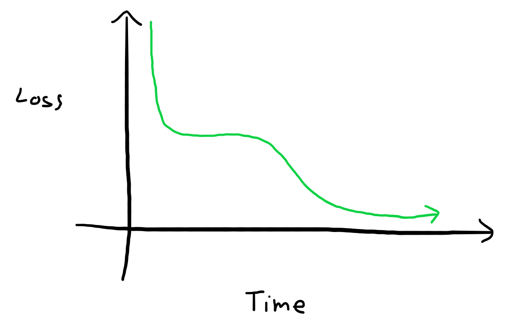

# UIB INF265 Project 1
Group: **Project 1 18**  
Students:
- **Mats Omland Dyrøy (mdy020)**
- **Linus Krystad Raaen (zec018)**

---

- [Summary](#1-summary)
- [Questions](#2-questions-and-answers)
  - [A. Which PyTorch method(s) correspond to the task described in section 2?](#a-which-pytorch-methods-correspond-to-the-task-described-in-section-2)
  - [B. Cite a method used to check whether the computed gradient of a function seems correct.](#b-cite-a-method-used-to-check-whether-the-computed-gradient-of-a-function-seems-correct)
  - [C. Which PyTorch method(s) correspond to the tasks described in section 3, question 4.?](#c-which-pytorch-methods-correspond-to-the-tasks-described-in-section-3-question-4)
  - [D. Briefly explain the purpose of adding momentum to the gradient descent algorithm.](#d-briefly-explain-the-purpose-of-adding-momentum-to-the-gradient-descent-algorithm)
  - [E. Briefly explain the purpose of adding regularization to the gradient descent algorithm.](#e-briefly-explain-the-purpose-of-adding-regularization-to-the-gradient-descent-algorithm)
  - [F. Report the different parameters used in section 3, question 8., the selected parameters in question 9. as well as the evaluation of your selected model.](#f-report-the-different-parameters-used-in-section-3-question-8-the-selected-parameters-in-question-9-as-well-as-the-evaluation-of-your-selected-model)
  - [G. Comment your results.](#g-comment-your-results)

## 1. Summary
In this section, we will summarize our approach to the two main tasks. Spesifically, we will discuss our code and why it is the way it is.

### Backpropagation
*Code can be found in `backpropagation.ipynb`*.  
*Relevant code inlcuded for reference:*  
```python
def backpropagation(model, y_true, y_pred):
    with torch.no_grad():
        # MSE = (pred - true)^2
        # MSE_derived = 2(pred - true)
        # The slope of the loss function can be computed like this:
        grad_post_activation = 2 * (y_pred - y_true)

        # Compute gradient for each layer backwords from output layer to the first hidden layer
        for layer in range(model.L, 0, -1):

            # Slope of loss with respect to pre-activation of current layer
            grad_pre_activation = grad_post_activation * model.df[layer](model.z[layer])

            # Compute gradients of the loss with respect to the weights and biases of the current layer
            model.dL_dw[layer] = torch.matmul(grad_pre_activation.T, model.a[layer - 1])
            model.dL_db[layer] = torch.sum(grad_pre_activation, dim=0)

            # Compute the gradient of the loss with respect to the output of the previous layer
            grad_post_activation = torch.matmul(grad_pre_activation, model.fc[str(layer)].weight)

        learning_rate = 1e-9
        for layer in range(1, model.L + 1):
            model.fc[str(layer)].weight -= learning_rate * model.dL_dw[layer]
            model.fc[str(layer)].bias -= learning_rate * model.dL_db[layer]
``` 
We tried to follow the formulas provided in section `2` as closely as possible.

We failed to be consistent with `autograd` or `finite differences`, so we had to introduce a scaling factor which we called `learning_rate`. We noticed that out gradients pointed in the right directions, but have way higher magnitudes than `finite differences`. Therefore, we kept moving `learning_rate` closer and closer to `0` untill the errors were sufficiently small. In the end, we landed on `1e-9`.

### Gradient descent
*Code can be found in `gradient_descent.ipynb`*  
*Some relevant code will be included for reference*  
The description of our approach will roughly follow the tasks in section `3` in order.

#### Task 1 to 3

The first hurdle was loading the dataset, as we kept getting type errors. We also somehow missed the hint abount `torch.set_default_dtype(torch.double)`, so we ended up with a different approach achiving the same result:
```python
transform = transforms.Compose([
    transforms.ToTensor(),

    transforms.ConvertImageDtype(torch.double),

    # Normalize the pixel color values to be between -1 and 1
    transforms.Normalize((0.5, 0.5, 0.5), (0.5, 0.5, 0.5))
])
```
We just added the conversion to our dataset transform instead.

Writing the `train`-function was trivial with access to all the bells and whistles in `PyTorch`.  
If we remove the debugging code used to sanity-check that the loss was going down, the function becomes very simple:
```python
def train(epoch_count, optimizer, model, loss_function, train_loader):
    for epoch in range(epoch_count):
        for X, y_true in train_loader:
            # Reset model gradients
            optimizer.zero_grad()
            
            # Compute loss and gradients
            loss = compute_loss(model, X, y_true, loss_function)
            loss.backward()

            # Update weights
            optimizer.step()
```
We did run into problems when the `y_true` and model output was in completely different formats. The model predicted `neuron-0` or `neuron-1` corresponding to label `0` and `2`, and thus we needed a helper-method to bridge the values to a similar format:
```python
def compute_loss(model, X, y_true, loss_function):
    # Map the labels to neurons
    # Label 0 (airplane) -> Neuron 0
    # Label 2 (bird) -> Neuron 1
    y_true = torch.Tensor([[1.0, 0.0] if i.item() == 0 else [0.0, 1.0] for i in y_true])

    y_pred = model(X)

    return loss_function(y_pred, y_true)
```

#### Task 4 to 7
We used `train` as a starting-point for `train_manual_update`:
```python
def train_manual_update(...):
    for epoch in range(epoch_count):
        for X, y_true in train_loader:
            # Reset model gradients
            model.zero_grad()
            
            # Compute loss and gradients
            loss = compute_loss(model, X, y_true, loss_function)
            loss.backward()

            # Update weights
            manual_sgd_step(...)
```

That magical function could be found by shamelessly paying a visit to the documentation site for SGD  
https://pytorch.org/docs/stable/generated/torch.optim.SGD.html  

We followed the formula in the documentation exactly, as the assignment said to generate the exact same numerical values:  
We did not need, nor implement `nesterov` or `maximize`.  
This is the code for one step for one parameter named `param`.  
```python
gradient = param.grad

# Apply L2 regularization
if weight_decay != 0:
    gradient = gradient.add(param, alpha=weight_decay)

# Apply momentum
if momentum != 0:
    velocity = momentum_buffer[i]
    if velocity is None:
        # Initialize the velocity as the gradient, not as zero
        velocity = torch.clone(gradient).detach()
        momentum_buffer[i] = velocity
    else:
        velocity.mul_(momentum).add_(gradient)

    gradient = velocity

# Update parameters
param.add_(gradient, alpha=-learning_rate)
```

#### Task 8 to 10

We copied the logging format in `gradient_descent_output.txt` as much as possible for no other reason than lack of creativity.  
We trained every model twice, once using `torch.optim.SGD` and once using out manual alternative.
We struggled getting the exact same values until we remembered that out initial weights are random.  
This snippet allowed us to reuse the initial weights from `model_sgd` in `model_manual`:  
```python
model_manual.load_state_dict(model_sgd.state_dict())
```

While training the models, we kept track of the best performing model on the validation dataset.  
This model was later tested on the test dataset to get an unbiased estimate of real world performance.  
We detail this further in [2. F](#f-report-the-different-parameters-used-in-section-3-question-8-the-selected-parameters-in-question-9-as-well-as-the-evaluation-of-your-selected-model) and [2. G](#g-comment-your-results).  
The exact output can be found in `gradient_descent.ipynb`.


## 2. Questions and answers
In this section, we will answer the questions from 4.2 in the report section of the assignment.

### A. Which PyTorch method(s) correspond to the task described in section 2?

*For reference...*
> ### 2.1 Task
> Using equations above, write a function backpropagation(model, y true, y pred) that computes:  
> *Gradient of weight (i,j)* and store them in `model.dL_dW[l][i,j]` for each layer l.  
> *Gradient of bias (i)* and store them in `model.dL_db[l][i]` for each layer l.

Calculating the gradients for the weights and the biases we used the following mathematical methods from `PyTorch`:  
- `Tensor.T`:  
  Calculates the transpose of a matrix-tensor.  
  In our calculations, we have a matrix `grad_pre_activation` which represents the gradient of the loss function with respect to the pre-activation of the current layer.  
  We then used `grad_pre_activation.T` to get the transpose of that matrix which we needed to calculate the gradient of the weights.

- `torch.matmul(Tensor a, Tensor b)`:  
  Calculates a regular matrix-multiplication of two matrices `a` and `b`.  
  In our calculations, we used it to multiply `grad_pre_activation.T` and the activation of the previous layer `model.a[layer - 1]` to get the gradient of the weights for the current layer `model.dL_dW[layer]`.

- `torch.sum(Tensor a, Integer dim)`:  
  Sums the elements of a along the given dimension.  
  In our calculations, we used it to sum `grad_pre_activation` along the `0`-dimension to get the gradient of the biases.

- `operator: double * Tensor`:  
  Scales all the elements in a `Tensor` by a `double` scalar.  
  In our calculations, we used it to scale the gradients by a given learning-rate.

- `operator: Tensor - Tensor`:  
  Subtracts elements in the last `Tensor` by the corresponding elements in the last `Tensor`.  
  In out calculation, we used this to update the weights and biases using the short-form `-=`-operator.

### B. Cite a method used to check whether the computed gradient of a function seems correct.

The gradient claculations are checked using two methods:
- `autograd`:  
  A `PyTorch` tool to compute gradients.  

- `finite differences method`  
  A function provided in `tests_backpropagation.py` to compute gradients using  
  $$ f(x + eps) - f(x - eps) \over 2eps $$  

### Briefly explain how you would use this method to check your computed gradients in section 2.

We used these methods as sanity-checks to ensure our gradients were not way off.  
The tests printed out errors, which we used to fine-tune the static `learning_rate` parameter.  
This *fine-tuning*, essentially amounted to just dividing `learning_rate` by `10` until all error became `0` (Or at least so close the difference did not matter).  
We ended up settling for $1{-9}$, which is way smaller than `eps` from `tests_backpropagation.py`, something we did not expect.

### C. Which PyTorch method(s) correspond to the tasks described in section 3, question 4.?

*The code is included for reference, please grade the code in `gradient_descent.ipynb`*.
```python
def train_manual_update(epoch_count, model, loss_function, learning_rate, momentum, weight_decay):

    momentum_buffer = [None for param in model.parameters()]

    for epoch in range(1, epoch_count + 1):

        # We aggregate the loss to print after each epoch
        # This is only for debugging purposes
        epoch_loss = 0.0
        epoch_size = 0

        for X, y_true in train_loader:

            # Reset model gradients
            model.zero_grad()

            # Compute loss and gradients
            loss = compute_loss(model, X, y_true, loss_function)
            loss.backward()
            
            # Update weights
            manual_sgd_step(model, learning_rate, momentum, weight_decay, momentum_buffer)

            epoch_loss += loss.item()
            epoch_size += 1

        # Print loss after some epochs
        # This is for debugging purposes
        if epoch == 1 or epoch % 5 == 0:
            print(f'Epoch {epoch} | Training loss: {epoch_loss / epoch_size}')

def manual_sgd_step(model, learning_rate, momentum, weight_decay, momentum_buffer):
    # A single step of SGD
    # Ref: https://pytorch.org/docs/stable/generated/torch.optim.SGD.html
    # Ref: https://pytorch.org/docs/stable/_modules/torch/optim/sgd.html#SGD
    with torch.no_grad():
        for i, param in enumerate(model.parameters()):
            gradient = param.grad

            # Apply L2 regularization
            if weight_decay != 0:
                gradient = gradient.add(param, alpha=weight_decay)

            # Apply momentum
            if momentum != 0:
                velocity = momentum_buffer[i]
                if velocity is None:
                    # Initialize the velocity as the gradient, not as zero
                    velocity = torch.clone(gradient).detach()
                    momentum_buffer[i] = velocity
                else:
                    velocity.mul_(momentum).add_(gradient)

                gradient = velocity
            
            # Update parameters
            param.add_(gradient, alpha=-learning_rate)
```

- `torch.zeros_like(Tensor t)`:  
  Creates a new tensor with the same shape as `t`, but all the elements are `0`.  
  We used this to initialize the gradient velocities for the parameters.

- `model.zero_grad()`:  
  Resets all the elements in the gradient tensors to `0`.

- `torch.no_grad()`:  
  Stops `PyTorch` from calculating gradients.  
  We use this to not compute gradients when updating the parameters and

- `Tensor.add_(Tensor t)`:  
  Adds a tensor `t` to the original tensor elementwize, thus mutating the original tensor.

- `Tensor.add(Tensor t)`:  
  Returns a new tensor which is the result of adding the original tensor to the tensor `t` elementwize.

- `Tensor.mut_(float f)`:
  Scales the original tensors elements by `f`, thus mutating the original tensot.

### D. Briefly explain the purpose of adding momentum to the gradient descent algorithm.
Momentum is a tool we can use in training as an attempt to glide across plateaus.   

Without momentum, we would reach the first plateau, but not any further.  
The hope is that momentum can help carry the progress across such plateaus into, hopefully, more progress.

*Look at that drawing!*

### E. Briefly explain the purpose of adding regularization to the gradient descent algorithm.
Regularization is a way to penalice large weights. The idea is that larger weights indicates a more complex model. We want simple models, so it serves as a counterweight pushing weights towards zero.  
In our case, we used L2 regularization, wich is essentually reducing the weigths by some fixed scale every optimization step. (By fixed scale, I mean we multiply the weights by a fixed number).

### F. Report the different parameters used in section 3, question 8., the selected parameters in question 9. as well as the evaluation of your selected model.

#### Global parameters:
| Parameter | Value |
| --------- | ----- |
| Batch size | `256` |
| Epoch count | `30` |
| Loss function | `CrossEntropyLoss` |
| Random seed | `123` |

These global parameters are not very creative and stolen from the `gradient_descent_outout.txt`.

#### Model parameters
| No | Learning rate | Momentum | Weight decay | Training accuracy | Validation accuracy |
|:-: | -------- | ------- | --------- | -------- | -------- |
|  1 | $ 0.01 $ | $ 0.0 $ | $ 0.000 $ | $ 83 $ % | $ 80 $ % |
|  2 | $ 0.10 $ | $ 0.0 $ | $ 0.000 $ | $ 89 $ % | $ 79 $ % |
|  3 | $ 0.01 $ | $ 0.0 $ | $ 0.010 $ | $ 82 $ % | $ 79 $ % |
|  4 | $ 0.01 $ | $ 0.9 $ | $ 0.000 $ | $ 94 $ % | $ 84 $ % |
|  5 | $ 0.01 $ | $ 0.9 $ | $ 0.010 $ | $ 94 $ % | $ 84 $ % |
|  6 | $ 0.01 $ | $ 0.9 $ | $ 0.001 $ | $ 94 $ % | $ 85 $ % |
|  7 | $ 0.01 $ | $ 0.8 $ | $ 0.010 $ | $ 96 $ % | $ 84 $ % |
|  8 | $ 0.10 $ | $ 0.9 $ | $ 0.010 $ | $ 87 $ % | $ 81 $ % |
|  9 | $ 0.10 $ | $ 0.9 $ | $ 0.001 $ | $ 94 $ % | $ 82 $ % |
| 10 | $ 0.10 $ | $ 0.9 $ | $ 0.010 $ | $ 87 $ % | $ 82 $ % |
| 11 | $ 0.90 $ | $ 0.9 $ | $ 0.010 $ | $ 50 $ % | $ 51 $ % |

The model that performed best on the validation set was `No 6`.  
Because we selected the best model at the validation set, we have an inherit bias for good performance on that dataset.  
Therefore, to get an unbiased performance estimate, we must measure the performance of `No 6` on another completely unseen dataset.  

#### Best model parameters (No 6)
| Parameter     | Value     |
| ------------- | --------- |
| Learning rate | $ 0.01 $  |
| Momentum      | $ 0.9 $   |
| Weight decay  | $ 0.001 $ |

#### Best model accuracy (No 6)
| Dataset    | Accuracy |
| ---------- | -------- |
| Training   | $ 94 $ % |
| Validation | $ 85 $ % |
| Test       | $ 85 $ % |

### G. Comment your results. 
**In case you do not get expected results, try to give potential reasons that would explain why your code does not work and/or your results differ.**

A quick google search on the dataset tells us that estimated human performance if roughfly 96% accuracy. <sup>[[medium](https://franky07724-57962.medium.com/once-upon-a-time-in-cifar-10-c26bb056b4ce)]</sup>  
Therefore, for some reason, we were expecting an accuracy of around or just below these numbers, but we struggled to get accuracies above the mid 80-s.

I suspect we could have gotten way better results using convolutions as that would implicitly preserve the significance of neighboring pixels.

We also had one model `No 11`, which performed susprisingly badly with a validation accuracy of `51%` (which somehow is better than the training accuracy).  
Looking at the logs, we suspect an exploading gradient:
```
Epoch 1 | Training loss: 11.48756237417679
Epoch 5 | Training loss: nan
Epoch 10 | Training loss: nan
Epoch 15 | Training loss: nan
Epoch 20 | Training loss: nan
Epoch 25 | Training loss: nan
Epoch 30 | Training loss: nan
```